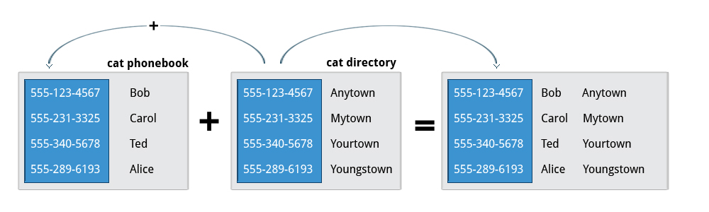

# Text Files

## Creating Text Files

- - - - -

### Without an Editor
```bash
    echo text > /filepath
    echo text >> /filepath
    echo -e text >> /filepath
```

The 'echo' command is used to display a line of text that is passed as an argument. The is mostly used by scripts to display text to the screen, but it's output can instead be redirected to a file. The 'escape' tag allows the use of special characters.

```bash
    cat > /filepath
```

The 'concatenate' method's output can be redirected to a file. So everything that is typed while the command is executing will appear at the specified path. 

- - - - -

### With an Editor

```bash
    nano /filepath
    gedit /filepath
```

'nano' and 'gedit' are the simplest text editors available to an user. 'nano' is used from the command line interface, while 'gedit' is a graphical text editor that requires a working GUI.

```bash
    vim /filepath
    emacs /filepath
```

'vim' and 'emacs' are much more advanced editors that require extensive knowledge of their functionality. Once mastered though, they will very easy text editing without the use of a mouse.

- - - - -

## File Manipulation

- - - - -

### Stream Editor (sed)

'sed' is a powerful tool that can filter text and perform substitutions in data streams. Data is taken from an input stream, put into a working directory, and then moved to the output stream once the changes have been made.

```bash
    sed <command> <filename>
    sed -e <command> -e <command> <filename>
    sed -f <scriptfile> <filename>
```

The 'Stream Editor' will take a command and execute it on the provided file. The 'expression' command will allow the user to provide many commands, while the 'file' command will allow the user to provide a script intead of commands.

**NOTE:** Output stream redirection may be required as the standard output stream is the console.

**Basic Commands:**

| Command                                      | Usage                                                 |
| -------------------------------------------- | ----------------------------------------------------- |
| sed s/regex/replace_string/ <filename>     | Substitute first string occurrence in every line      |
| sed s/regex/replace_string/g <filename>    | Substitute all string occurrences in every line       |
| sed 1,3s/regex/replace_string/g <filename> | Substitute all string occurrences from lines 1 to 3   |
| sed -i s/regex/replace_string/g <filename> | Save changes for string substitution in the same file |

- - - - -

### Aho, Weinberger, Kernighan (awk)

Named after its authors, 'awk' is used to extract and print specific contents of a file. It works well with records; records consist of lines with unique data in a defined format.

```bash
    awk <command> <filename>
    awk -f <scriptfile> <filename>
```

'awk' has very similar syntax to 'sed', except it doesn't have the 'expression' option.

**Basic Commands:**
| Command                               | Usage                                                          |
| ------------------------------------- | -------------------------------------------------------------- |
| awk '{ print $0 }' /etc/passwd        | Print entire file                                              |
| awk -F: '{ print $1 }' /etc/passwd    | Print first field (column) of every line, separated by a space |
| awk -F: '{ print $1 $7 }' /etc/passwd | Print first and seventh field of every line                    |

- - - - -

### Unique (uniq)

```bash
    uniq <filename> > <new-file>
    uniq -c <filename>
```

**Unique** gets rid of consecutive duplicate entries, based on line order. The **count** flag counts the number of duplicate entries. Because the lines have to be consecutive, they need to be sorted first.

### sort

```bash
    sort <filename>
    sort -u <filename>
    sort -r <filename>
    sork -k <number> <filename>
```

**sort** performs collation, sorting line by line. The **unique** flag also gets rid of consecutive duplicate entries. The **reverse** flag sorts the lines in reverse order, while the **key** flag sorts lines by the n<sup>th</sup> field sorted by space.

### paste


```bash
    paste <filename> <filename> ...
    paste -d '<delimiters>' <filename> <filename>
    paste -s <filename> <filename>
```

As best shown by the above image, the **paste** function treats each line in each file as an individual entity. The n<sup>th</sup> lines from each file are then combined into a single line, creating a single file. The **delimiter** flag lets the user specify which delimiters to use in order to seperate the final values. Each delimiter is used in the order specified and loops back to the beginning if needed. The default delimiter to space values is TAB. Lastly, the **serial** flag appends all data in each provided file on a single line; the number of lines equals the number of provided files.

### join



```bash
    join <filename> <filename> ...
```

**join** works like paste, except it looks for similar fields. If two files have the exact same fields within a column, then joins the remainining fields based on the common field.

### split

```bash
    split <filename> <new-file>
```

By default, **split** breaks up a file into individual 1000-line files. Each of the files will be named **new-filex**, where **x** starts at **a** and ends at **x**. More suffix letters will be added if needed. As seen by its functionality, this function is only really used on large files. 