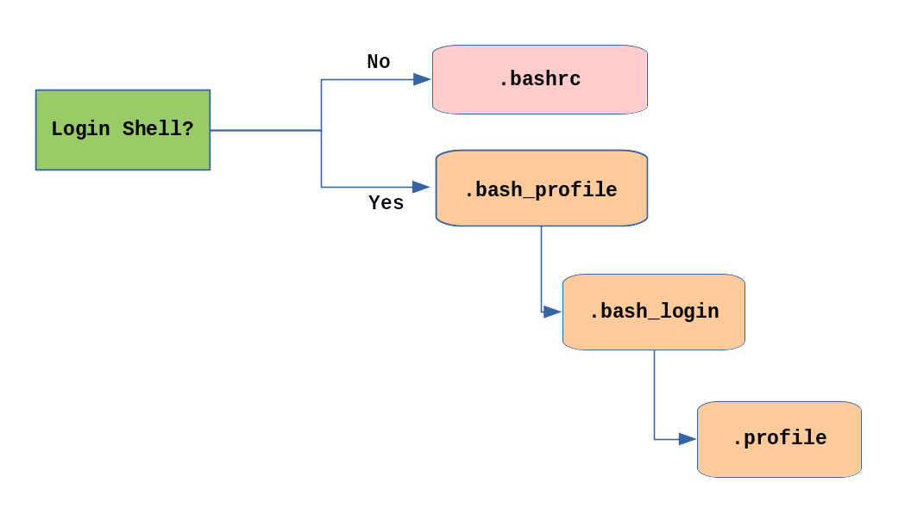

# User Environment

## Order of Startup Files



When a new terminal window is created, the '.bashrc' file is read and evaluated. This is because opening a terminal window isn't treated as a new user logging into the system. When a user does login to the computer, the other files are accessed for in the order shown. Once a file is found, the other files are ignored. 

**Note:** Different distributions may use different startup files.

## Users and Groups

Linux uses groups to organize users. Control of group membership is controlled by the 'etc/group' file, which shows a list of groups and their members.

## Identifying the Current User

```bash
    whoami
    who
    who -a
```

Type 'whoami' to identify the current user. Type 'who' to list the currently logged-on users. Use the 'all' flag with the who command to recieve more detailed information.

```bash
    id
    id <username>
```

Typing 'id' will give the specified UID, GID, and what group the specified username is part of. If no username is specified, it will provide details of the current user.

```bash
    groups 
    groups <username>
```

'groups' displays the groups that the specified or current user belong to.

## Adding and Removing Users

```bash
    sudo useradd <username>
```

Only the root user can add and remove users and groups. Once the 'useradd' command is used, basic files are copied from '/etc/skel' to the home directory of the new user.

```bash
    sudo userdel <username>
    sudo userdel -r <username>
```

'User Delete' will delete the current user, but will leave its home directory intact. To remove the home directory, use the 'remove' command.

## Adding and Removing Groups

```bash
    sudo /usr/sbin/groupadd <groupname>
    sudo /usr/sbin/groupdel <groupname>
```

A new group can be added with 'groupadd' and 'groupdel'. A pathname needs to be specified because the PATH environment variable doesn't contain the 'system binaries' directory.

```bash
    groupmod -g <new-GID> <groupname>
    group -n <new-name> <groupname>
```

## User/Group Relationship

```bash
    sudo /usr/sbin/usermod -a -G <groupname> <username>
    sudo /usr/sbin/usermod -a -G <groupname>,<groupname> <username>
```

'User Modification' is used to add a user to single or multiple groups. The 'append' flag prevents removing existing groups, while the 'Groups' flag is used to list the groups to add the user to.

```bash
    sudo /usr/sbin/usermod -G <groupname>,<groupname> <username>
```

Removing groups is similar to adding groups using 'User Modification'. Essentially, without the 'append' flag, the new list of groups the user is part of will replace the old list of groups.